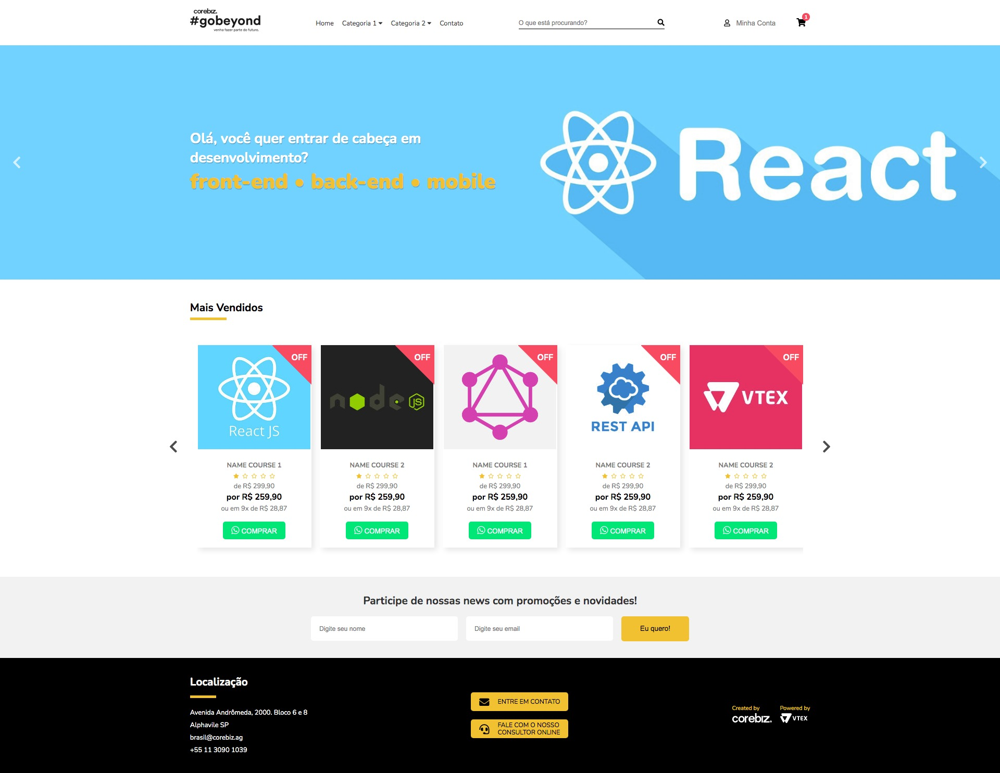

<p align="center">
  <a href="" rel="noopener">
 </a>
</p>

<h3 align="center">Desafio 02 - Go Beyond | Corebiz</h3>

<div align="center">

[]() [](/LICENSE)

</div>

---

<p align="center"> Criar uma home page com base no layout proposto através do link do <a href="https://www.figma.com/file/Q6R28bCLDpizGZT6YvJGcm/Corebiz---Go-Beyond-2021?node-id=1%3A2">Figma</a>
    <br> 
</p>

## 👀 Preview


## 📝 Table of Contents

- [About](#about)
- [Features](#features)
- [Deployment](#deployment)
- [Authors](#authors)
- [Acknowledgments](#acknowledgement)

## 🧐 About <a name = "about"></a>

Para esse desafio não foi exigido o tipo de linguagem, mas sim, que se aproximasse o máximo do layout proposto.

### ⚒️ Person Challenge
Apesar de eu ter iniciado uma opção desse desafio em <strong>ReactJS</strong>, <em>pois seria uma forma de testar meus conhecimentos nessa lib e entender de fato qual o meu nível, e assim então descobrir os itens que devo priorizar nos estudos desta</em>. Porém acabei por não concluir, devido ao pouco conhecimento na lib e dificuldades em aplicar as mesmas lógicas utilizadas com <strong>JavaScript</strong> puro <a href="https://github.com/juslenelobeu/Carousel-JS-Puro">nesse carousel</a>.

### ✅ I learned

Apesar de já utilizar o <strong>CSS</strong> no dia-a-dia, para fazer este desafio, pude aprofundar meus conhecimentos em algumas propriedades, como:
- [nth-child()](https://developer.mozilla.org/pt-BR/docs/Web/CSS/:nth-child) - Utilizado para modificar os posicionamentos para a versão mobile:
```
.header__content .flex-col:nth-child(1) {
  order: 2;
}
.header__content .flex-col:nth-child(4) {
  order: 3;
}
.header__content .flex-col:nth-child(4) .flex-row {
  gap: 0rem;
}
.header__content .flex-col:nth-child(3) {
  margin: 0 auto;
  order: 4;
}
```
- [border](https://developer.mozilla.org/en-US/docs/Web/CSS/border) - Utilizada de uma forma diferente para fazer a base das tags dos produtos listados:
```
.product__bg-tag {
  position: absolute;
  right: 0;
  top: 0;
  border-bottom: 4.7rem solid transparent;
  border-right: 4.7rem solid var(--color-danger);
}
```

## ✨ Features <a name = "features"></a>

- [x] Menu responsivo com aplicações em script **JavaScript** e **CSS** puro 
- [x] Menu com dropdown em css puro 
- [x] Slider com aplicação de script em **JavaScript** puro para navegação entre os itens 
- [ ] Carousel de produtos com navegação 
- [x] Validação do form para cadastro na newsletter 
- [x] Dados salvo no localStorage
- [ ] Validação em tempo real para campos vazio
- [ ] Script para capturar cliques no produto listado e alterar o número no ícone de carrinho no topo e adicionar em um array para listar este em menu suspenso (*quick view*)

## 🚀 Deployment <a name = "deployment"></a>

Link Github Pages: [preview](https://juslenelobeu.github.io/corebiz-gobeyond-desafio-01/)

## ⛏️ Built Using <a name = "built_using"></a>

- [HTML](https://developer.mozilla.org/pt-BR/docs/Web/HTML) - Markup language
- [CSS](https://developer.mozilla.org/pt-BR/docs/Web/CSS) - Styles
- [JavaScript](https://developer.mozilla.org/pt-BR/docs/Web/JavaScript) - Interaction

## ✍️ Authors <a name = "authors"></a>
<a href="https://juslenelobeudesigner.com.br/">
  
  <br />
  <sub><b>Juslene Lobeu</b>👩🏻‍💻</sub>
</a>

Feito com&ensp;❤️&ensp;por Juslene Lobeu&ensp;👋🏽&ensp;Entre em contato!

[](https://juslenelobeudesigner.com.br/) 
[](https://www.linkedin.com/in/kjuslenelobeu/) 
[](mailto:juslenelobeu@gmail.com)

## 🎉 Acknowledgements <a name = "acknowledgement"></a>

- Hat tip to anyone whose code was used
- Inspiration
- References
